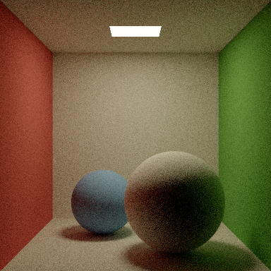

# WebGPU Path Tracer

A physically-based Monte Carlo path tracer that runs entirely in WebGPU compute
shaders. No rendering libraries — the intersection routines, the acceleration
structure and the light transport are all implemented here.

**[Run it in the browser →](https://dhanushkrishna4.github.io/WebGPU-path-tracer/)**
Needs a WebGPU-capable browser: Chrome or Edge 113+, Safari 18+, or Firefox 141+.
There is no fallback renderer, so a browser without it gets an explanation and a
still image rather than a blank page.

**Status: all 19 build steps complete.** WebGPU initialisation, a CPU reference
tracer producing a correct Cornell box, a GPU megakernel that matches it,
progressive accumulation with tone mapping and interactive camera controls,
triangle meshes traversed through a binned-SAH BVH, a GGX microfacet BSDF that
passes the white furnace test, chi-squared validation that every sampler matches
its own PDF, next event estimation combined with BSDF sampling by multiple
importance sampling, a **wavefront** architecture running alongside the
megakernel — six kernels with GPU-side queue compaction and indirect dispatch,
selectable from the CLI and the browser — a **GPU-built linear BVH** (Morton
codes, a radix sort, Karras's hierarchy and an AABB fit, all in compute shaders),
**transmission** (rough dielectrics with Fresnel-weighted refraction, total
internal reflection, and light sampling that works through glass), **environment lighting** importance-sampled with a 2D CDF,
**Owen-scrambled Sobol sampling**, **instancing** through a two-level
hierarchy, an **edge-avoiding à-trous denoiser**, **diagnostic render
modes**, and a full control panel with depth of field and a **measured**
convergence readout — per-pixel variance reduced on the GPU, validated against
the spread of sixteen independent renders rather than modelled as `1/sqrt(N)` —
deployed to GitHub Pages from source on every push.



---

## Architecture

Host language decision: **TypeScript in the browser, Rust for the reference
tracer and the test harness.**

The reason for Rust was never the browser host — it was that a native CPU
reference renderer is the only practical way to validate GPU output, and that
does not require the host to be Rust. Splitting them means the browser side is
plain WebGPU with no wasm-bindgen boundary between the UI and the renderer,
while the correctness oracle stays native and fast.

```
crates/core/    scene, meshes, BVH, CPU reference tracer, GPU buffer layout
crates/gpu/     native wgpu harness — runs the same WGSL under `cargo test`
crates/cli/     offline renderer, image comparison, codegen
shaders/        WGSL, shared verbatim by the native harness and the browser
web/            TypeScript + Vite host
```

### The native harness is the point

`crates/gpu` loads the **same WGSL files** the browser loads and runs them
natively. That gives three things a browser-only setup cannot:

* CPU-vs-GPU comparison runs in `cargo test`, in under a second, with no browser
  round trip;
* compute kernels can be unit tested against known inputs — which is how the
  radix sort, the Karras hierarchy and the AABB fit are each validated against a
  CPU twin, rather than by staring at a BVH heatmap;
* RenderDoc and Metal frame capture work.

The browser is then validated against the native GPU, so any remaining
difference is a wgpu-versus-browser-WebGPU difference and not an unknown.

### One source of truth for buffer layout

Three languages have an opinion about how bytes sit in a storage buffer. Silent
disagreement between them is the worst class of bug in the project: the image
renders, it is just wrong, and the cause is a four-byte offset you cannot see.

So `crates/core/src/gpu_layout.rs` is authoritative, and codegen emits the
mirrors:

| generated file | contents |
|---|---|
| `shaders/common/generated.wgsl` | WGSL `struct` declarations |
| `web/src/generated/layout.ts` | byte offsets + the uniform packer |
| `web/src/generated/scenes.ts` | scene manifests + camera fixtures |
| `web/public/scenes/*.bin` | **pre-packed** scene geometry, fetched at runtime |

Scene geometry reaches the browser as a single pre-packed binary per scene — every
array concatenated at 16-byte alignment, with offsets generated alongside — so no
TypeScript code lays out a scene struct and none can get it wrong. Scenes above
2 MB packed are **not committed** — they are downloaded on demand and cached in
IndexedDB; see below. The threshold is checked rather than hardcoded, so a scene
that grows past it drops out of the repository automatically instead of silently
bloating it. The only hand-written packing on
the host is the uniform block, whose offsets are generated. `cargo run -p pt-cli
--bin codegen -- --check` fails if any mirror is stale.

The one genuine duplication is the camera basis, because orbit controls need it
live on the host. It is guarded: codegen emits Rust's answers as fixtures and
`web/src/camera.ts` checks itself against them at startup.

### Why CPU and GPU agree so closely

Both draw from **bit-identical random streams**. WGSL has no 64-bit integers, so
the usual PCG32 cannot be ported to a shader; this uses PCG-RXS-M-XS with a
32-bit state, which is pure `u32` arithmetic and expressible identically in Rust
and WGSL. Seeding is counter-based — `hash(frame, pixel, sample)` — so no
atomics, and a pixel's stream does not depend on thread scheduling.

The consequence is that the only legitimate difference between the two renders
is floating-point reassociation, chiefly FMA contraction (~1e-4 accumulated).
Monte Carlo noise at practical sample counts is ~1e-1. There are three orders of
magnitude between "same computation, reassociated" and "two independent
estimates of the same integral", and landing in between means something is
genuinely wrong.

Measured at 512×512, 512 spp, 8 bounces:

| comparison | mean relative error |
|---|---|
| CPU vs native GPU | 2.34e-4 |
| CPU vs browser | 2.44e-4 |
| **Monte Carlo noise floor** (same renderer, different seed) | **2.64e-1** |

The CPU/GPU difference is **0.0009×** the noise floor. The difference image at
40× amplification is black with sparse isolated speckles — individual
silhouette-grazing rays where rounding flipped a hit/miss — with no uniform haze
(numerical bias), no localised blob (geometry bug) and no material-correlated
region (BSDF bug).

---

## Materials and the white furnace test

A principled BSDF: Lambertian diffuse under a GGX specular layer, with
height-correlated Smith masking-shadowing, visible-normal sampling, Schlick
Fresnel for dielectrics and the exact complex-IOR equations for conductors.

### The furnace test is the point of this step

Put an object with a pure-white, non-absorbing BSDF in an environment of uniform
radiance 1. A correct, energy-conserving BSDF renders it **exactly invisible**.
Anything you can see is energy the model invented or destroyed.

Single-scattering GGX fails this badly, and it is supposed to — the test's job is
to reveal it. Measured directional albedo, which must be 1:

```
roughness   cos=0.95   cos=0.6   cos=0.2
0.05          1.0000    1.0000    0.9999
0.20          0.9981    0.9965    0.9751
0.40          0.9661    0.9407    0.8706
1.00          0.3176    0.4124    0.6427     <- 68% of the light destroyed
```

`G2` accounts for light that hits one microfacet and leaves; light that bounces
*between* microfacets is marked masked and dropped. On a rough surface most of it
does. The fix is Turquin's compensation — scale the lobe by the fraction that
went missing — which makes the albedo exactly 1 by construction:

```
f = f_single * (1 + F_avg * (1 - E(mu_o)) / E(mu_o))
```

After compensation, worst deviation from 1.0 across the whole
roughness × angle grid is **0.0017**. `F_avg` carries the colour, because energy
that bounced repeatedly was filtered by Fresnel each time.

`furnace-test` is a scene you can look at: five spheres of increasing roughness
in a uniform environment, which render as a flat blank field. The
whole-renderer version is asserted numerically — mean radiance **0.99994** on the
CPU and **0.99995** on the GPU.

### Three numerical findings

**`ggx_d` cancelled catastrophically.** The textbook denominator
`(n.m)^2 (alpha^2 - 1) + 1` loses most of its mantissa when `alpha^2` is tiny.
The algebraically identical `alpha^2 c^2 + sin^2(theta)` does not, because both
terms are small and positive.

**`f32` has a hard floor on roughness.** The denominator needs `sin^2(theta)`,
but the call site only has `cos(theta)` as an `f32`, and near the lobe centre
that is within one ULP of 1.0 — so `1 - cos^2` underflows and `D` explodes.
Measured, integrating `D(m)(n.m)`, which must be 1:

```
alpha    1e-5     1e-4     3e-4    1e-3    2e-3      4e-3
         596.4    6.10     1.245   1.002   0.9996    1.000002
```

The clamp this code originally used was `1e-4` — a **6× energy gain** on
near-mirror surfaces. It is now `2e-3`; below that the right answer is a delta
specular lobe. Dielectrics landed at step 12 and kept this clamp rather than
adding a delta path: at `2e-3` the roughest visible difference is below the
noise floor of any render that reaches it.

**Schlick is less accurate than usually claimed.** Measured against the exact
dielectric equations at IOR 1.5, maximum absolute error is **0.036** near
`cos_theta = 0.09` — it climbs toward 1 too early at grazing angles.

### Layering, and a lobe that reflected more than arrived

The diffuse and specular lobes are not independent: the specular layer sits over
the diffuse base, so light it reflects never reaches the base. Adding them
directly let a smooth blue plastic reflect **1.40** in the blue channel at
grazing incidence. The base now receives only what the layer transmits, estimated
with the same structure as the compensation — Fresnel at this angle for the
single-scattered part, hemispherical average for the multiply-scattered
remainder.

### Why the renders agree despite a badly conditioned pdf

Visible-normal sampling makes `D` cancel between the BRDF and the pdf, leaving
`F * G2 / G1(wo)`. That matters numerically as well as for variance: at the
roughness floor the raw pdf differs by 11% between Rust and WGSL (a 5e-5
difference in the sampled normal moves `D` by 25×, since its denominator there is
`alpha^2 = 4e-6`), while the **weight** agrees to 1e-4 across the entire range.
The quantity that reaches the image is well conditioned even where its
ingredients are not.

---

## Multiple importance sampling

Three strategies, selectable at runtime, all estimating the same integral:

| | finds light by | good at | bad at |
|---|---|---|---|
| **BSDF** | bouncing into an emitter | large emitters, sharp reflections | small bright emitters |
| **NEE** | connecting to a sampled point on a light | small emitters, diffuse surfaces | large emitters seen in near-mirrors |
| **MIS** | both, weighted | both | — |

MIS weights each direction by how densely the strategy that produced it samples,
using the **power heuristic** with β=2:

```text
  w_a = p_a^2 / (p_a^2 + p_b^2)
```

The weights sum to 1 for any pair of densities, which is what keeps the combined
estimator unbiased — no path counted twice, none dropped. Squaring is what makes
it better than the balance heuristic (β=1): it pushes weight harder toward
whichever strategy sampled densely, suppressing the low-probability samples that
become fireflies.

Computed as `1 / (1 + (p_b/p_a)^2)` rather than literally squaring both.
Algebraically identical, and it degrades to exactly 0 or 1 rather than to NaN
however extreme the pair becomes — a GGX pdf reaches 1e5 at low roughness.

### The scene that makes the case

`mis-scene` is a Veach-style layout built so each strategy fails somewhere: four
glossy plates of increasing roughness reflecting four emitters of increasing
size and **equal total power**, so the only difference between the emitters is
how hard each is to find.

Measured at 64 samples per pixel:

```
mode     relative noise    vs best
bsdf            0.08115      2.37x
nee             0.06374      1.86x
mis             0.03419      1.00x
```

MIS beats **both**, rather than landing between them. That is the test: a weight
stuck at 1 for light samples and 0 for BSDF ones is just NEE wearing a different
name, and would pass any comparison against NEE alone.

Each plate's tilt is *solved for* rather than fixed — a plate reflects the light
row toward the camera only if its normal bisects the view direction and the
direction to the lights. A single shared tilt aims only the nearest plate and
leaves the rest dark, which is exactly what the first attempt produced.

### Where the strategies visibly fail

At 48 spp on that scene:

* **BSDF-only** speckles everywhere — the small intensely bright emitter subtends
  almost no solid angle, so a bounce finds it only by luck, and when it does the
  contribution is enormous.
* **NEE** is clean on the small emitters and conspicuously noisy where the
  *large* emitter reflects in the *sharp* plates: light sampling scatters points
  across a broad emitter that a narrow BSDF lobe then evaluates at nearly zero.
* **MIS** is clean in both regions.

### All three converge to the same image

Asserted on both devices:

```
  512 spp: bsdf 0.162809, nee 0.160796, mis 0.160796
 2048 spp: bsdf 0.162011, nee 0.161243, mis 0.161243
 8192 spp: bsdf 0.161436, nee 0.161438, mis 0.161438
```

MIS and NEE agreeing to six digits on the Cornell box is correct rather than
suspicious: the light pdf there is roughly twenty times the BSDF pdf from a
diffuse surface, so light samples take weight 0.998 and the BSDF path takes
0.002, and the two reconstruct the same total. MIS doing real work is asserted
separately, on the scene where neither strategy dominates.

On `mis-scene`, NEE's estimator has tails heavy enough that its mean is still 4%
off at 4096 spp and only reaches 1.0026 of MIS at 16384 — while MIS is stable
from 64 spp. That is a better argument for MIS than any prose.

---

## Next event estimation

Two strategies for finding light, selectable at runtime:

* **BSDF sampling** — bounce and hope to land on an emitter. Unbiased, and
  hopeless for a small light: the Cornell box's ceiling panel is hit by a few
  percent of bounces.
* **Next event estimation** — connect every path vertex directly to a sampled
  point on a light, and cast a shadow ray to check.

At the same 64 samples per pixel, BSDF-only is barely readable and NEE is clean.
Measured on the relative-error metric, NEE is **8.6× less noisy**.

They must nonetheless converge to the *same* image, and that is asserted on both
devices:

```
  512 spp: ratio 0.987634   rmse 0.03330
 2048 spp: ratio 0.995255   rmse 0.01646
 8192 spp: ratio 1.000018   rmse 0.00826
```

The mean converges to a ratio of 1.000018, and — the stronger statement — the
per-pixel difference keeps **halving with every quadrupling of samples**. If the
two converged to different images that difference would stop shrinking and
plateau at the systematic offset. Continued 1/sqrt(N) decay means it is pure
noise around a common answer.

### The measure conversion

This is where energy bugs live, so the derivation is written once in
`crates/core/src/light.rs` and everything refers to it.

Light sampling picks a **point**, so its density is with respect to **area**:
`p_A = p_select / area`. The transport integral is over **solid angle**, and so
is the BSDF's PDF. Adding one to the other is adding apples to oranges, and
produces an image that looks entirely plausible and is wrong by a factor that
varies with distance.

```text
  dw = dA * |cos(theta')| / d^2        ->    p_w = p_A * d^2 / |cos(theta')|
```

Tested directly rather than by inspection: integrating `1/p_w` over the sampled
directions must give the solid angle the light actually subtends, and a
rectangle's solid angle has a closed form. At heights 3, 10 and 40 the two agree
to a relative difference of **0.0000**.

(Monte Carlo was tried as the reference first and abandoned — at height 40 the
light subtends 0.0024 sr, so four million hemisphere samples give only ~1500 hits
and the *reference* carried 2.6% error. The test was failing on noise in its own
ground truth.)

### Two rules that are easy to get backwards

**Emission must be suppressed after the first bounce.** Under NEE, the light
reached by a bounce was already accounted for by the shadow ray from the previous
vertex; counting it again roughly doubles the scene's brightness. The exception
is the camera ray — nothing preceded it — and forgetting that renders the light
fixture black while the room it lights looks perfect. There is a test for exactly
that.

**Splitting an emitter must change nothing.** One light of area `A` and two of
area `A/2` describe the same physical emitter, so `1/(1*A)` and `1/(2*(A/2))`
have to come out equal. That is why the light count and the per-light area must
appear together in the PDF — and it is what would break every quad light the
moment it became two triangles.

### The binding budget forced a refactor

WebGPU guarantees only **eight storage buffers per shader stage**, and the
renderer already used all eight. The light list needed a ninth.

Spheres and quads now share one tagged 64-byte `Primitive` array, freeing a
binding permanently. Spheres waste 32 bytes each, which is nothing at the scale
analytic primitives exist at, and the change collapses two intersection loops
into one. The alternatives all borrowed rather than bought: capping the light
count, dropping UVs, or requiring a limit WebGPU does not guarantee.

---

## Chi-squared sampling validation

A BSDF has two halves that must agree: `sample()` draws directions, and `pdf()`
claims how densely it draws them. When they disagree the estimator
`f * cos / pdf` is weighted wrongly and **every image is biased** — not noisy,
biased, converging confidently to the wrong answer.

Nothing else in this suite finds that. The image looks plausible. Energy
conservation still holds. CPU and GPU still agree, because they are wrong
together. Even "does `pdf()` return what `sample()` reported for this direction"
passes, because that only asks the two functions to be consistent about a
*number*, not that the number describes where samples actually land.

So: draw 600,000 directions, histogram them over the hemisphere, integrate the
claimed density over the same bins, and test the difference with Pearson's
chi-squared statistic. Every lobe, swept across roughness and viewing angle —
45 configurations, all passing.

```
diffuse                        p = 0.80   (30,428 pooled bins)
ggx roughness 0.1  cos_o 0.95  p = 0.73
ggx roughness 0.5  cos_o 0.45  p = 0.69
ggx roughness 1.0  cos_o 0.95  p = 0.78   acceptance 0.5125 vs pdf mass 0.5128
copper             cos_o 0.5   p = 0.37
gold               cos_o 0.9   p = 0.64
```

### The test has to be able to fail

A statistical test that always passes is decoration. Three deliberately broken
samplers are checked in, and each must be **rejected**:

* a pdf 4% too large;
* a sampler skewed toward the pole while its pdf still claims uniform — the
  failure an energy check cannot see, because the mass is right and only its
  distribution is wrong;
* a two-lobe BSDF reporting only the chosen lobe's density instead of the
  mixture, which is the classic version of this bug and renders perfectly
  plausible images.

If any of those ever starts passing, the harness has lost its sensitivity and
every other result in that file is worthless.

### Three details that matter

**Bins are uniform in `theta`, not in `cos(theta)`.** Equal-solid-angle bins
sound more natural, but they are wide in angle near the pole and a glossy lobe is
narrow in angle — an entire GGX lobe can land in one cell, leaving nothing to
test.

**Rejected samples stay in the denominator.** A VNDF sample whose reflection goes
below the surface is discarded, and the pdf integrates to less than 1 by exactly
that probability. Normalising by *attempts* turns that into a second assertion:
at roughness 1.0 half the samples are rejected, and the pdf accounts for the
missing mass to four decimal places.

**The quadrature is adaptive.** A fixed 8-point Simpson rule underestimated a
narrow near-grazing lobe by 2.7%, which the test read as a sampler producing too
many samples there — a false positive, which in a statistical test is worse than
no test at all. Coarse and fine estimates are now compared and the cell
subdivided where they disagree; tightening the tolerance 100× changes no result,
which is the evidence that it is converged.

### Distinguishing a low p-value from a bug

With 45 configurations, the smallest p-value is *expected* to be small. The way
to tell chance from bias is to resample —
`cargo run --release -p pt-core --example chi2_seed_sweep` re-runs the
closest-to-failing configuration across 16 seeds. Under the null hypothesis
p-values are uniform, so a correct sampler scatters and a biased one does not:

```
p = 0.93, 0.76, 0.78, 0.23, 0.64, 0.23, 0.38, 0.28,
    0.07, 0.07, 0.83, 0.10, 0.27, 0.01, 0.15, 0.58
median 0.28, one below 0.01 (expect 0.16) -> consistent with chance
```

The GPU is not tested this way directly. It does not need to be: the WGSL
sampler and pdf are checked term by term against the Rust ones in
`crates/gpu/tests/bsdf_agreement.rs`, and the Rust ones are checked here.

---

## Display transforms

The renderer works in linear HDR from the camera to the display pass. Tone
mapping lives in a **separate fragment pass**, not in the integrator, so
switching operators or scrubbing exposure re-runs a shader rather than the light
transport — a converged image stays converged while you adjust it.

The pipeline, stated once:

```
linear HDR radiance
  -> * exposure              (a pure scale, in scene-linear)
  -> tone map                (HDR -> display-linear, still linear)
  -> sRGB transfer function  (display-linear -> display code values)
```

Every operator returns **display-linear** values; the sRGB encode happens once,
afterwards. This matters more than it sounds: several widely-copied ACES and AgX
snippets end in display-*encoded* space, and applying sRGB on top of those
double-encodes and washes out the shadows.

| operator | middle grey (sRGB) | character |
|---|---|---|
| clamp | 0.461 | no curve; the reference point |
| Reinhard | 0.427 | `x/(1+x)` per channel; desaturates toward white |
| ACES | 0.359 | Hill's RRT+ODT fit; darkens mid-tones, rotates hue |
| AgX | 0.501 | film-like path to white; preserves hue |

ACES uses **Stephen Hill's fit**, deliberately not Narkowicz's one-liner: that
fit targets the ODT's already-encoded output, so whether a gamma step belongs
after it is genuinely ambiguous, and that ambiguity is why so many
implementations of it are subtly wrong.

The operators exist twice — Rust for the CLI, WGSL for the browser — so
`crates/gpu/tests/tonemap_agreement.rs` evaluates the WGSL on the GPU and diffs
it against Rust at ~70 probe inputs spanning black to 1e4. That caught a real
bug: both AgX matrices were transposed. Nothing in the image would have said so,
but the row-sum invariant does — a grey-preserving matrix has rows summing to 1,
and the transposed ones summed to 1.106.

## Interactive camera

Drag to orbit, shift-drag or middle-drag to pan, scroll to dolly (exponentially,
so zoom feels the same at any distance).

Camera movement resets accumulation, so while the camera is moving there is
nothing worth preserving — which is what makes **resolution scaling** the right
interactivity lever here rather than sparse shading. A closed-loop controller
measures GPU frame time and picks a divisor from {1, 2, 4, 8} to hit a frame
budget, then snaps back to full resolution the moment the user lets go.

Two implementation notes:

* The accumulation buffer is always allocated at full resolution and reduced
  scales write a **compact prefix** of it — a 1/4-scale frame needs 1/16 of the
  pixels, so it always fits. Changing scale costs no reallocation, no second
  buffer and no bind group rebuild.
* Stepping coarser is allowed sooner than stepping finer (1.15x over budget
  versus 2x under), and both require three consecutive votes. Symmetric
  thresholds make the controller oscillate between neighbouring scales, because
  halving the divisor quadruples the pixel count.

Measured on an Apple M-series integrated GPU at 512×512, 8 bounces:

```
budget  2 ms  ->  1/8 scale (64x64),   1.4 ms/frame
budget 60 ms  ->  1/1 scale (512x512), 7.0 ms/frame
released      ->  1/1 scale immediately
```

---

## Acceleration structure

A binned-SAH BVH, built on the CPU in `crates/core/src/bvh.rs` and traversed
identically on both devices. This is the *quality reference*: the GPU LBVH at
build step 11 is the fast builder, and this is the thing it gets measured
against.

Measured with real camera rays at 256×256:

| scene | triangles | nodes | depth | SAH cost | node visits/ray | tri tests/ray |
|---|---|---|---|---|---|---|
| cornell-mesh | 10,252 | 11,165 | 16 | 21.0 | 12.5 | 2.6 |
| bvh-stress | 368,640 | 397,711 | 20 | 80.8 | 7.3 | 0.6 |

SAH cost is the expected triangle tests per ray under the model the builder is
minimising — 4560× better than brute force on the stress scene. Unlike a frame
time it is machine independent, which is what makes it the right number to
compare builders by.

In the browser, on a 10k-triangle scene at 256×256, 1 spp, 4 bounces:

```
BVH on     3.4 ms/frame
BVH off  199.1 ms/frame   ->  59x
```

The **BVH: off** button is not a fallback for weak hardware. It switches the
shader to testing every triangle — the same reference path the correctness tests
compare against — so the speedup above is measurable from the UI.

### Design notes

**32-byte nodes.** Half a cache line, so a node and its two children span at
most two. The child pointer and the primitive range share a field: `count == 0`
means internal and `left_first` is the left child (the right is always
`left_first + 1`, since children are allocated adjacently); `count > 0` means
leaf. Growing the node past 32 bytes is the easiest way to lose a large fraction
of traversal performance, so `size_of::<GpuBvhNode>() == 32` is asserted.

**Triangles are compacted into traversal order** after the build, so leaves index
the triangle array directly. That removes an indirection *and* a storage buffer —
which matters concretely, because WebGPU guarantees only 8 per shader stage and
this renderer binds exactly 8. It also makes a leaf's triangles contiguous in
memory.

**Near child first.** Descending into the nearer child means that by the time the
farther one is popped, the closest hit has often already shrunk below its entry
distance and the subtree is culled unentered. Costs one compare; without it about
half of all traversals do the work in the useless order.

**A 32-entry shader stack**, half the CPU's 64. The stack lives in per-thread
private memory, which on most hardware means registers, and every slot costs
occupancy for every thread whether used or not. It holds only deferred siblings —
one per level actually descended — so its depth is the tree's depth, and the
builder is asserted to stay under 3× log2(N).

### Two robustness bugs worth knowing about

**`0 * inf = NaN` in the slab test.** WGSL leaves float division by zero
implementation-defined, and even where it yields infinity, a ray whose origin
lies exactly on a slab plane computes `0 * inf`. The NaN silently turns a hit
into a miss. Both sides now use a reciprocal clamped to a large *finite*
magnitude, so no infinity ever enters the arithmetic.

**Flat AABBs.** Every axis-aligned triangle — a wall, a floor, anything
architectural — produces a zero-extent box, where a ray travelling in its plane
enters and exits at the same instant and rounding decides arbitrarily whether
that counts. The failure mode is a *false negative*: geometry goes
intermittently missing in a way that reads as noise. Triangle bounds are padded
outward by a magnitude-relative epsilon, making every box conservative. A false
positive costs one wasted triangle test; a false negative costs an afternoon.

---

## Running it

```bash
# Browser
npm --prefix web install
npm --prefix web run dev

# CPU reference render
cargo run --release -p pt-cli --bin render -- --device cpu --spp 512 --out out/cornell

# Both devices, with the Monte Carlo noise floor for scale
cargo run --release -p pt-cli --bin render -- --device both --noise-floor --spp 512

# Everything
cargo test --workspace --release
```

GPU tests skip with a loud notice when no adapter is available, so the suite
still runs headless.

### Comparing the browser against the reference

The dev server mounts a `POST /__dump/<name>` endpoint (dev only — `vite build`
never sees it) that writes to `out/`. The **Send HDR to ./out** button uses it,
so the round trip is one click:

```bash
cargo run --release -p pt-cli --bin compare -- \
  out/cornell-cpu.pfm out/browser-512.pfm --diff out/diff.png --scale 40
```

Comparison is done on linear-float PFM, never PNG — 8-bit tone-mapped output
discards exactly the information the comparison depends on.

### Useful commands

```bash
cargo run --release -p pt-cli --bin render -- --tonemap agx --exposure 1.5  # PNG only; the PFM stays linear
cargo run -p pt-cli --bin codegen                        # regenerate mirrors
cargo run -p pt-cli --bin codegen -- --check             # fail if stale (CI)
cargo run -p pt-cli --bin dump-shader -- trace/megakernel.wgsl   # resolved WGSL, numbered
WGPU_BACKEND=vulkan cargo test -p pt-gpu                 # cross-backend check

# Architectures, side by side (the default is both, so the ratio is one run)
cargo run --release -p pt-cli --bin bench -- --width 512 --spp 8 --depth 8
cargo run --release -p pt-cli --bin bench -- --depth-sweep --scene cornell-mesh
cargo run --release -p pt-cli --bin render -- --architecture wavefront --device gpu

# BVH builders, side by side
cargo run --release -p pt-cli --bin bench -- --bvh-build
cargo run --release -p pt-cli --bin render -- --bvh lbvh --scene cornell-mesh
PT_LBVH_TIMING=1 cargo run --release -p pt-cli --bin bench -- --bvh-build

# Isolate what sample batching buys: same work, different pass count
PT_WAVEFRONT_BATCH=1 cargo run --release -p pt-cli --bin bench -- --architecture wavefront
```

---

## Two architectures

Both are kept, because neither wins everywhere and which one wins is a property
of the scene.

The **megakernel** runs a whole path in one shader. Threads execute in lockstep
within a warp, so a warp keeps iterating until its longest-lived path finishes:
cost tracks the bounce *limit* rather than the average path length. Register
allocation is static too, so a thread that is only shading still pays for the
32-entry traversal stack.

The **wavefront** splits the path into six kernels — GENERATE, EXTEND, SHADE,
CONNECT, RESET, RESOLVE — with atomic append queues between them and indirect
dispatch, so dead paths are compacted out and later bounces dispatch over fewer
threads. Dispatch sizes never return to the host; each stage sizes the next by
writing workgroup counts into a buffer that `dispatchWorkgroupsIndirect` reads,
because a readback between stages would stall for longer than the architecture
saves.

Raising the bounce limit from 1 to 32 at 256×256, 8 spp (ms):

|                  |  d=1 |  d=2 |  d=4 |  d=8 | d=16 | d=32 | ratio |
|------------------|-----:|-----:|-----:|-----:|-----:|-----:|------:|
| cornell-mesh mega| 5.25 | 9.87 |22.42 |42.67 |65.82 |74.92 | 14.3× |
| cornell-mesh wave|13.68 |18.12 |26.17 |40.09 |45.65 |48.36 |  3.5× |
| bvh-stress mega  |10.29 |19.90 |44.61 |85.35 |130.97|157.49| 15.3× |
| bvh-stress wave  |16.34 |26.20 |41.58 |63.06 |82.37 |88.66 |  5.4× |

That is the claim, measured. The megakernel scales with the limit; the wavefront
scales with how long paths actually live. They cross over around depth 4–8, and
by depth 32 the wavefront is 1.55× faster on `cornell-mesh` and 1.78× on
`bvh-stress`. Chrome reproduces the shape on the same hardware: 0.66× at depth
2, 1.35× at depth 8, 1.48× at depth 32.

The cost is that path state moves from registers to global memory and back at
every bounce — 80 bytes per path per stage — and a queue is only worth compacting
if paths die at different times. On a geometrically trivial scene neither pays
off and the wavefront is *slower*: at 512×512, 8 spp, depth 8 it runs at 0.16×
the megakernel on `furnace-test` and 0.58× on `cornell-box`, against 1.22× on
`cornell-mesh` and 1.31× on `bvh-stress`.

Two constraints shaped the implementation more than anything else:

* **Eight storage buffers per shader stage**, counted across every bind group.
  The union of what the six kernels touch is fourteen, so a single shared layout
  fails outright. Each kernel declares exactly what it uses, `scene.wgsl` and
  `bvh.wgsl` are split so CONNECT need not bind vertex attributes, and EXTEND
  reads a sentinel-terminated queue instead of a length so it can skip binding
  the counters.
* **A buffer cannot be both a read-write binding and the indirect source** of a
  dispatch. So the queue counters and the indirect dispatch arguments live in
  separate buffers, and only RESET — the one stage dispatched directly — writes
  the arguments.

## Two BVH builders

The **binned-SAH** builder splits top-down against an actual cost model. It makes
the better tree and it cannot be parallelised: every split depends on the
partition its parent chose. That sets the floor on how long a geometry change
takes to become renderable.

The **linear** builder (Lauterbach 2009, Karras 2012) gives up tree quality for
parallelism. Every stage is a map or a sort:

```text
  1. Morton code     one per primitive, independent          O(n) parallel
  2. radix sort      by code                                 O(n) parallel
  3. hierarchy       Karras: each internal node found alone   O(1) per node
  4. AABB fit        each node from its own sorted range     O(n log n) parallel
```

Stage 3 is the interesting one: for a *sorted* Morton array the tree is implicit
in the codes' shared prefixes, so a node can determine its own range and split by
reading only that array — nothing another thread wrote.

| 368k triangles | binned SAH (CPU) | linear (CPU) | linear (GPU) |
|----------------|-----------------:|-------------:|-------------:|
| build time     |            60 ms |        31 ms |    **29 ms** |
| traversal cost |             1.00 |         1.26 |         1.26 |

So the GPU build is 2.1x faster than the sequential one for a tree 26% more
expensive to traverse — worth it when geometry changes every frame, not worth it
for a scene loaded once. On a 10k-triangle scene the fixed costs dominate and the
CPU wins outright. `bench --bvh-build` prints both, and `render --bvh lbvh`
renders with it; the two trees are bit-identical in the image, which is the one
thing an acceleration structure must be.

### Two WGSL things worth knowing

* **The textbook AABB fit is not safe in WGSL.** Every published LBVH walks
  bottom-up from the leaves with an atomic per node, so the second child to
  arrive merges. The second thread then reads a box written by a *different
  workgroup* in the same dispatch — and WGSL atomics are relaxed while
  `storageBarrier()` synchronises a workgroup, not a device. It happens to work
  on most hardware, which is the worst property a race can have; here it had the
  root covering 1319 of 10252 primitives, varying run to run. The fit is instead
  restated per node over its own sorted range, which reads nothing the dispatch
  wrote.
* **Guessing at GPU performance does not work.** The first working build took
  130 ms, twice the CPU's. Three hypotheses — shader recompilation, readback
  stalls, degenerate Morton chains — were all wrong and bought 8 ms between them.
  Instrumenting put 43 ms of 58 in the fit, because it dispatched one workgroup
  per node and seven eighths of a Morton tree's nodes have ranges under eight.
  Splitting the fit by node size took it to 3.2 ms. `PT_LBVH_TIMING=1` prints the
  per-stage breakdown that found it.

## Binary versus 4-wide: the experiment

A ray costs about 31 node visits and 3.7 triangle tests on `bvh-stress`, so
traversal — not intersection — is where the time goes, and node width is the
lever. Rather than port a 4-wide tree to the GPU on that argument, it was built
and measured on the CPU first:

| bvh-stress          | binary | 4-wide |  ratio |
|---------------------|-------:|-------:|-------:|
| node visits / ray   |   31.0 |   16.2 | **0.52x** |
| box tests / ray     |   62.0 |   65.0 |  1.05x |
| triangle tests / ray|    3.7 |    3.8 |  1.02x |
| tree depth          |     20 |     10 |  0.50x |
| memory              | 12.7 MB| 12.5 MB|  0.98x |
| CPU traversal time  | 11.6 ms| 11.4 ms|  0.97x |

The structural wins are real and the risk is measured to be nil: half the node
fetches, half the stack depth, the same memory, and — the thing that could have
gone wrong — the same triangle tests, meaning tree quality is preserved.

**On the CPU it is a wash in wall-clock**, which is the expected and honest
result: a scalar CPU gains nothing from four box tests being groupable, and
halving the visits does not help when each visit does twice the work. The payoff
is a GPU property the CPU cannot exhibit — four independent box tests map to one
`vec4` operation, traversal there is latency-bound so halving fetches matters
more, and the stack lives in the private memory whose size sets the register
pressure of the whole megakernel.

So the experiment did its job: it de-risked the port and priced the structural
gains, and it says the wall-clock answer needs the GPU. What it also caught is
worth keeping: the first 4-wide traversal walked child slots in array order
instead of front-to-back, and triangle tests per ray went from 3.7 to **9.0** —
a tree that was measurably wider and materially worse. `closest` only shrinks
when a near hit is found, and every leaf opened before that is work the ordering
would have culled.

## Dielectrics

Glass is a GGX microfacet BTDF (Walter et al. 2007) sharing the visible-normal
distribution with the reflection lobe, so the two are halves of one interface
rather than two surfaces stacked. There is **no smooth-glass special case**: the
existing `MIN_ALPHA` floor of 2e-3 means a mirror-flat dielectric is a very
narrow lobe rather than a delta distribution, so it goes through the same
sample/pdf/MIS machinery as everything else and needs no separate path through
the integrator, the light sampler, or the MIS weights.

Three things in this step were easy to get wrong in ways that still look like
glass, and each is pinned by a test that names the symptom:

* **The `eta^2` that isn't there.** A BTDF is not symmetric — radiance is
  compressed by `eta^2` entering a denser medium — so a camera-path tracer
  carries a `1/eta^2` importance-transport correction that cancels it exactly.
  Keeping the BTDF's `eta^2` and forgetting the correction is 2.25x too bright
  for glass and reads as "a bit glowy". The invariant is written out as
  `reflect + eta^2 * transmit == 1`, measured at 1.000 +/- 0.002 across every
  IOR and angle, with `glass_round_trip_is_lossless` checking that the factor
  really does undo itself on the way out.
* **Which side to offset the ray origin.** A transmitted ray goes *into* the
  surface, so the usual push along the outward normal leaves it on the wrong
  side, re-hitting the surface it just crossed. Every BSDF unit test still
  passed; the render was solid black.
* **Light sampling has to see through glass.** Rejecting every direction below
  the surface is not merely a missing feature — under MIS the BSDF strategy
  discounts itself assuming light sampling could have found the same direction,
  so the two sum to less than one and anything lit through glass is
  systematically dim.

The white furnace test is the one that covers all three at once: a non-absorbing
dielectric sphere in a uniform environment must be invisible. Measured, **smooth
glass 0.99948 and diamond 0.99901** — the integrator's handling of transmission
is exact. Rough glass comes back at 0.964, and that 3.6% is not a bug: the
reflection lobe carries a multiple-scattering compensation table (step 8) and the
transmission lobe has no equivalent, so what leaks is the second and later
bounces off the microsurface. The bound is set to catch that growing.

### What the chi-squared suite found

Four real bugs, none of which changed the image in a way that looked wrong:

| symptom | cause |
|---|---|
| sampler transmitted 95%, pdf accounted for 25% | reused the *reflected-direction* VNDF density, which already has the `1/(4 cos)` Jacobian folded in, for transmission |
| pdf integrated to 1.00064 | `\|wo.m\|` instead of `max(0, wo.m)` — density assigned to microfacets the sampler cannot produce |
| 1.5% more samples transmitted than the pdf described | at high roughness a *reflection* about a tilted microfacet can land in the lower hemisphere and be mistaken for a transmission |
| sampler reflected 100%, pdf accounted for 95% | past the critical angle the Fresnel clamp reserved 5% of samples for a lobe that cannot produce a direction, and the TIR fallback silently dumped them into reflection |

Telling these apart from *quadrature* error in the test harness took a
discriminator worth recording: a real sample-vs-pdf mismatch keeps the pdf's
total mass wrong at every bin resolution, while an under-resolved integral has
the right total and a statistic that falls toward 1 as bins are refined. Both
kinds occurred here.

## Environment lighting

An equirectangular sky, sampled by inverting a two-dimensional CDF: pick a row
from the marginal distribution, then a column from that row's conditional. Both
inversions are binary searches, which is the shape of thing a GPU runs without
diverging.

The distribution is built on **luminance times `sin(theta)`**, not luminance
alone. An equirectangular map is a rectangle and the sphere is not — rows near
the poles are stretched, covering a vanishing sliver of solid angle — so
`dw = 2 pi^2 sin(theta) du dv`, and getting the density proportional to radiance
*in solid angle* means weighting by the sine. Leave it out and the sampler
oversamples the poles by a factor that grows without bound.

Measured on a diffuse sphere under a sun four orders of magnitude brighter than
the sky around it: **7.8x less per-pixel noise** than BSDF sampling alone, and
the sun receives 49.8% of the samples while holding 49.6% of the map's power.

### Textures, not storage buffers

Forced rather than preferred. The wavefront's SHADE stage already binds exactly
**eight** storage buffers, which is WebGPU's *guaranteed* per-stage limit counted
across every bind group, so there was no room for the map or its CDFs. Sampled
textures come from a separate budget.

`textureLoad` and never `textureSample`, which turns out to be the correct
lookup and not merely the available one: the CDF describes a piecewise-constant
image, so a bilinearly filtered radiance would not be the quantity the density is
proportional to, and the estimator would pick up a bias no energy test would
catch.

### What importance sampling does not fix

It removes the variance of *finding* the sun. It does nothing for paths that
reach the sun after a specular bounce — off a mirror, or through glass — because
those directions are chosen by the BSDF and the sky sampler never gets to steer
them. Measured on `sunset`: per-pixel noise is 0.042 on the diffuse sphere alone
but 0.091 for the full scene, and quadrupling the samples cuts it by 0.71x rather
than the 0.5x of a well-behaved estimator. That slower-than-`1/sqrt(N)` rate is
the signature of a heavy tail, and it is what caustics are. Fixing it needs a
different family of techniques — photon mapping, VCM, path guiding — not a better
environment CDF.

## Sobol sampling

Independent random points clump by chance, and that clumping *is* the variance.
A low-discrepancy sequence cannot clump — but a raw Sobol sequence is
deterministic, so every pixel would share the same residual error and the image
would show structure rather than noise. **Owen scrambling** randomises it per
pixel while preserving the stratification, via Burley's hash formulation: four
multiplies on the bit-reversed value in place of a tree of random numbers.

Direction numbers are **generated** from primitive polynomials rather than
transcribed, and `codegen` emits the WGSL copy from that same Rust, so the two
cannot drift. Two base dimensions, with every higher dimension padded onto them
under its own seed — measured, only Sobol's leading pair is a strict
(0, 2)-sequence:

```text
  (0,1): t = 0     (0,2): t = 1     (0,3): t = 2
                   (1,2): t = 1     (1,3): t = 2     (2,3): t = 2
```

A `t` of 2 permits four points per cell where the ideal permits one. Since a path
tracer draws in **pairs**, pairing every 2-D draw with the ideal `(0, 1)` beats
spreading draws across four dimensions of mixed quality — so `next_vec2` aligns
to an even dimension, and that rule has to be mirrored exactly in WGSL because it
shifts which dimension every later draw receives.

### What it actually buys

| | independent | sobol | ratio |
|---|---:|---:|---:|
| cornell-box | 0.2165 | 0.1825 | **1.19x** |
| cornell-mesh | 0.2181 | 0.1711 | **1.27x** |
| mis-scene | 0.2438 | 0.1799 | **1.36x** |
| sunset (caustics) | 0.0903 | 0.1022 | 0.88x |

And it is a better **constant**, not a better rate. On a smooth diffuse render
the ratio goes 1.33x at 16 spp, 1.40x at 64, 1.39x at 256 — it rises once and
flattens. The *sequence* does far better than that: integrating a smooth analytic
function, its error ratio against random grows from 79x at 64 points to 2246x at
4096, which is a genuinely better rate. A path tracer does not see that, because
its integrand is discontinuous at every silhouette and shadow boundary and runs
to thirty-odd dimensions. Worth stating plainly, because "Sobol converges as
1/N" is true of the sequence and not of the renderer using it.

On `sunset` it is slightly *worse*, and that is pinned rather than hidden:
stratification spreads samples evenly, which does nothing for an integrand whose
mass sits in a region too small for the strata to resolve. That is what a caustic
is.

## Instancing

A **BLAS** is an ordinary BVH over one mesh's triangles in that mesh's own
coordinates, built once and shared. A **TLAS** is a BVH over *instances* — a
transform and a BLAS reference. A ray walks the TLAS in world space; at each
instance it reaches, it is transformed into object space and walks the BLAS
there.

`instance-forest` stores 49 copies of an icosphere as **320 triangles, not
15 680**, with one BLAS and a 49-leaf TLAS.

### The trick that makes it cheap: do not normalise

The object-space ray direction is deliberately left **unnormalised**. Keeping its
world-space scale means a hit at parameter `t` is at the same `t` in both spaces
— so `t` values from different instances are comparable, the traversal's `t_max`
culling keeps working across levels, and the hit position needs no transforming
back. Normalise it and every `t` returns in a different unit, which makes scaled
instances sort incorrectly against one another and looks like nothing in
particular.

Only the **inverse** matrix is stored. The forward one is never needed: the ray
goes world → object through the inverse, the hit position comes back for free,
and a normal transforms by the inverse-transpose, which is the transpose of the
3×3 part of the inverse — already in hand.

### Instances cost zero bindings

EXTEND already binds exactly **eight** storage buffers, WebGPU's guaranteed
per-stage limit counted across every bind group, so instancing had to cost none.
`GpuInstance` therefore **overlays `GpuPrimitive`** — identical size, `kind` tag
at the identical offset — and instances live in the same array as spheres and
quads, discriminated by the tag the shader already reads. A 64-byte tagged union
with four `vec3` slots and four spare scalars happens to be exactly a 3×4 inverse
transform plus metadata. The overlay is pinned field-by-field by
`instance_overlays_primitive`, because a drift in either size or the tag's offset
would have the shader read a transform's bits as a sphere radius.

## Denoising

An edge-avoiding à-trous wavelet filter (Dammertz et al. 2010), guided by the
**albedo, normal and depth of the first hit** — noise-free channels, because they
come from one deterministic intersection rather than from an integral. It runs on
the accumulation at display time and never writes to it, so one more sample still
converges to the unbiased answer.

**Off by default.** A denoiser trades variance for bias, and what this renderer
shows unasked should be what it computed. `--denoise N` on the CLI, a slider in
the browser.

### What it buys, measured against a converged reference

| spp | typical pixel (median) | tail (p99) |
|----:|-----------------------:|-----------:|
|   4 |          **2.4x** better |  1.4x better |
|  16 |          **1.4x** better |  0.5x (worse) |
|  32 |                    1.05x |  — |
| 256 |            0.45x (worse) |  — |

It helps below roughly 32 spp and hurts above it. That crossover is pinned by a
test rather than left as folklore, because it is the number an automatic mode
would key on.

### Why RMSE barely moves, and why that is the honest framing

On the Cornell box at 4 spp the **worst 1% of pixels hold 98% of the squared
error** — median error 0.019 against an RMSE of 0.196. RMSE is therefore almost
entirely a firefly metric, and an edge-avoiding filter cannot move it *by
design*: its luminance weight sees an outlier as a different surface and refuses
to blend it away. Judging this denoiser by RMSE measures how well it suppresses
fireflies, which is a different technique with its own bias, and reports ~1.0x
however well the filter is actually working. So the claim is stated on the
median, and the tail is reported beside it rather than hidden.

### Two bugs the measurements found

* **The luminance tolerance was measured on the modulated image** while the
  filter compares *demodulated* values. An area light sits at radiance 16 beside
  a ceiling at 0.2, so its local deviation is enormous, the tolerance derived
  from it admits every neighbour, and the filter smeared the light across the
  ceiling: the Cornell box lost **39% of its energy** and the light dimmed from
  18.4 to 4.7.
* **A light and the ceiling it is set into share a normal and a depth**, so
  neither of those weights separated them. That needed a fourth edge-stopping
  term on albedo — demodulation removes *texture* from the filter's view, which
  is a different problem from *material boundaries*.

## Diagnostic modes

`--mode normal | albedo | depth | heat`, and a dropdown in the browser.

Almost every bug in this project produced an image that **still looked like the
scene** — a transposed BVH count, a normal transformed by the matrix instead of
its inverse-transpose, a sampler reading a stale sample index. Each was found by
diffing against a reference that happened to exist. A diagnostic mode is a
reference that needs no second implementation: a wrong normal transform is
obvious at a glance in a normal pass, and a badly built BVH is obvious in a
heatmap in a way a render time never quite is, because the heatmap says *where*
the cost is.

They are nearly free. Normals, albedo and depth are the **guide channels the
denoiser already records**, so displaying them is a branch in the display pass
and no work at all in the tracer. The heatmap needed one increment in the
traversal loop and the one spare word those guides left in the accumulation
buffer.

Two details that are choices rather than defaults:

* **The heat scale is fixed, not auto-scaled.** Auto-scaling to the image's own
  maximum makes every heatmap look the same — the worst pixel is always white —
  so it can never say whether a change helped, which is the only question anyone
  asks of one. Fixed at 128 node visits, two heatmaps are comparable.
* **Diagnostics bypass tone mapping.** Exposure and a filmic curve are for
  radiance; putting a normal map through one would make a diagnostic misreport
  its own values, which is the single thing a diagnostic cannot do.

The heatmap is checked against an independent fact rather than against itself:
the linear BVH is a measurably worse tree than the binned-SAH one, so the same
scene rendered with each must show the difference. Measured, **12.5 against 14.4
node visits per ray** — the 1.15x the cost model predicts.

## Large scene assets: not committed, cached in IndexedDB

`bvh-stress` packs to **27 MB**. Committing it would charge every clone, every CI
run and every deploy for a file most visitors never open — and git keeps it
forever, so a later re-pack adds a second copy rather than replacing the first.

Codegen keeps anything over 2 MB out of the repository and writes it under a
**content-addressed** name (`bvh-stress-5164eca50f3f3003.bin`), which
`.gitignore` excludes by pattern. The browser downloads it once, with progress,
and stores it in IndexedDB.

The content-addressed filename is what makes the cache correct, and it does the
job on its own. Re-packing a scene produces a *new* filename rather than new
bytes behind an old one, so a stale entry can never be served for fresh
geometry — there is no expiry to tune and no cache version to remember to bump.
The key is the filename rather than the URL, so moving the asset to a different
host does not orphan a copy someone already has. Measured: second page load
issues **zero** network requests for the blob and reads all 27 MB back from
IndexedDB.

The hash is a cache key and a truncation check, not a security measure, and the
loader deliberately does **not** recompute it. Authenticity comes from TLS;
truncation — the failure that actually happens — is caught by the byte-length
check, which matters because a short read produces garbage geometry that renders
as noise rather than as an error. Verifying a 64-bit FNV-1a over 27 MB in
JavaScript would need 32-bit limb arithmetic (BigInt is far too slow at that
size) to catch nothing the cheaper checks miss.

### Why not GitHub release assets

That was the first design, and it is wrong. Release assets are the obvious place
for a large file that should not be committed — but `github.com/.../releases/
download/...` serves **no `access-control-allow-origin` header**, so a browser
`fetch` of one fails with an opaque `TypeError: Failed to fetch`. Confirmed by
actually issuing the cross-origin request, after `curl -I` showed the missing
header, rather than discovering it after a deploy.

So the release is still where the blob is *published* — it stays out of git —
but the **Pages workflow pulls it into the built site server-side**, where CORS
does not apply. The asset is then same-origin and CDN-backed like everything else
Pages serves, and the IndexedDB cache is still doing the work that matters:
saving a 27 MB download on every repeat visit.

The mechanism stays host-agnostic. `PT_ASSET_BASE` at build time points the
loader at any CDN that sends CORS headers; empty, the default, means "alongside
the site".

```bash
cargo run --release -p pt-cli --bin codegen
gh release upload scenes web/public/scenes/*-*.bin --clobber
```

## The interface, and a convergence readout that is measured

Everything in the control panel is a knob on something the renderer does, and
every number in a panel note is one this project measured. The two additions
that are more than plumbing are below.

### "Is it done yet" should be a measurement

A progressive renderer's most-asked question has an obvious cheap answer:
`1/sqrt(N)` is one line and needs no GPU work at all. It is also wrong exactly
when it is being asked. That curve describes an estimator with finite,
well-sampled variance, and the scenes where anyone wonders whether an image is
finished are the ones with a caustic or a firefly making that false — the same
heavy tails that made the denoiser's RMSE barely move, three sections up.

So the readout is measured. Every pixel already accumulated the **sum** of its
per-sample estimates; it now also accumulates the **sum of squares**, which makes
the per-pixel variance `sum_sq/N - mean²` and the standard error of the mean
`sqrt(var/N)`. Dividing by the pixel's own mean makes it *relative*, so it is
comparable between a bright wall and a dim corner and between one scene and
another; the reported figure is the mean of that over the pixels bright enough to
have one. A two-pass reduction (`shaders/stats/convergence.wgsl`) folds a
megapixel into one float, and the browser reads it back asynchronously on a pool
of staging buffers — a `mapAsync` awaited inside the frame loop would serialise
the CPU against the GPU and turn a diagnostic into a frame-rate cost.

It costs 16 bytes per pixel, which is what widened `Accum` from 48 to 64 bytes:
4 MiB more at 512x512. The one arithmetic subtlety is that the squares must be of
the **per-sample estimate**, not of the running mean — squaring an average
measures nothing, and the failure mode is a number that looks plausible and falls
at roughly the right rate while being off by a factor of `sqrt(N)`.

**Validated against a ground truth, not against itself.** Render the Cornell box
sixteen times with independent seeds and measure how much the answer actually
moved; that spread *is* the standard error the meter claims to report.

| what | meter | true spread of 16 renders | ratio |
| --- | --- | --- | --- |
| independent sampler, 64 spp | 0.11408 | 0.11836 | **0.96x** |
| Sobol, 64 spp | 0.11487 | 0.09057 | **1.27x** |

The first row is the correctness test: within 4%, where the failure modes it
rules out (squaring the mean, dividing by N once instead of twice) are off by
factors of eight or more. The second row is not an error — it is the meter being
**honestly conservative**. `Var[mean] = Var[sample]/N` assumes independent
samples, and breaking that assumption is Sobol's entire purpose: stratification
correlates the samples so they cannot clump, so the true spread lands *below* the
independent-sample formula. Correcting for it would mean estimating the
stratification gain, which is scene-dependent and is exactly the quantity nobody
can get cheaply. Of the two ways to be wrong, over-reporting noise is the one
that does not tell someone an image is finished when it is not.

Three more checks:

* **A strictly worse strategy must read worse.** BSDF-only sampling of the
  Cornell box's small ceiling light reports **9.0x** the error MIS does at equal
  samples. Whatever the meter is measuring, if it did not separate those it would
  not be measuring noise.
* **It must fall with samples.** 16 → 1024 spp tracks `1/sqrt(N)` to within 11%
  on the box.
* **Both architectures must agree.** The sum of squares is accumulated in two
  different shaders, and the wavefront's copy of the shading logic has drifted
  from the megakernel's three separate times in this project. They report
  **0.11487 and 0.11487**.

An earlier version of the directional test compared *scenes* — cornell-box
against sunset, reasoning that a mirror and a glass ball make caustics. It
failed, and the meter was right: sunset reads **0.039** against the box's
**0.115**. Nearly every pixel in sunset is directly lit by an environment that
light sampling covers well, and the caustic is a small minority of pixels that a
mean over the image barely feels; the box is mostly multiply-bounced light. "Has
caustics" and "is noisier on average" are different claims, and only one of them
is testable. The test now compares two sampling strategies on one scene, where
the ordering is structural rather than aesthetic.

The browser shows it in the overlay alongside elapsed and remaining time, and
extrapolates to answer "how many more samples to reach 1%" — which is the one
place the `1/sqrt(N)` model is the right tool, because it is projecting from a
measurement rather than replacing one, and a fresh measurement corrects it every
few frames. The CLI prints the same figure after a GPU render, so an offline
render and a browser render can be compared on it directly:

```text
  gpu  done in 869 ms
noise    11.50% mean relative standard error
         (conservative: the estimate assumes independent samples)
```

It is not reported for a denoised render. A filtered image's per-pixel spread is
no longer the standard error of anything — the filter deliberately traded
variance for bias, and reporting the reduced variance as convergence would be
advertising exactly the half of that trade that flatters it.

### Depth of field, and focusing by clicking

The thin-lens camera has been in the renderer since the camera existed and was
unreachable from the browser. It is two random numbers per sample: jitter the ray
origin across the aperture while keeping it aimed at the same point on the image
plane, so everything at the focus distance stays sharp. It converges like any
other integral — a wide aperture is noisier at low sample counts and identical at
high ones, which the noise readout now shows directly.

**Focus on a click** costs one 32-byte readback, because the first-hit distance
is already in the accumulation buffer: the denoiser needs a noise-free depth as a
guide channel and has been writing it since step 16. Clicking the centre of the
Cornell box reads 1355.2 against an analytic 1355 — the camera sits 800 from the
origin and the back wall is at 555.

Aperture is a **diameter in scene units**, not an f-number. An f-number is a
ratio to a focal length, and this renderer has no physical sensor size to derive
one from: the Cornell box is 555 units across because the original measurements
were in millimetres, and calling it 555 mm would be a fiction. Both lens sliders
take their range from the camera's distance to its target instead, re-derived
when a scene loads, because the scenes here disagree about scale by three orders
of magnitude. Dollying re-focuses on the orbit target by default and stops the
moment a focus distance is set by hand — the two behaviours are both right and
cannot coexist, so it is a checkbox rather than a guess.

### Three stride bugs, and why only one of them was loud

Growing `Accum` from 48 to 64 bytes broke two places that had written the stride
as a literal, and the two failed in opposite ways. A later audit found a third
that had been broken for two build steps.

The browser's `readbackHDR` sized its staging buffer from the generated
`ACCUM_BYTES_PER_PIXEL` and then walked it with a **hardcoded stride of 4
floats** — correct when `Accum` was 16 bytes, wrong since the denoiser's guide
channels made it 48. It never failed loudly: the HDR export read every fourth
pixel's radiance and returned a perfectly well-formed image of the wrong thing.

The native denoiser allocated its output as `pixels * 48`, and that one failed
immediately and precisely: *"copy at offset 0 for 589824 bytes would end up
overrunning the bounds of the source buffer of size 442368"*, which is 9216
pixels times 64 against 9216 times 48. It was caught by the test that reads that
buffer back and diffs it against the CPU reference — a test written for an
entirely different reason, which is the usual way these are found.

The difference between the two is the whole argument for the generated-layout
approach. A buffer **sized** from the struct and **indexed** by a literal is the
worst of both: it is the only combination that stays silent. Both now derive the
stride from the same place the struct does.

The third was the worst of the lot, and it was found by going looking rather than
by anything failing. `web/src/wavefront.ts` declared its per-path buffer strides
as literals under the comment *"Sizes from `crates/core/src/gpu_layout.rs`, which
is the source of truth"* — which reads as generated and drifts like a copy.
`PathState` grew from 80 to 112 bytes at step 16, when the denoiser's guide
channels moved into it (SHADE cannot reach the accumulation buffer; it already
binds the eight storage buffers WebGPU guarantees, so the guides have to ride to
RESOLVE inside the path state). The literal stayed at 80.

So the browser allocated **71% of the path pool it then indexed**. Nothing
faulted: WGSL clamps an out-of-bounds index rather than trapping, so the
overflowing paths piled onto the last valid slot and overwrote each other. The
result still looked like a path-traced Cornell box, still converged, still
reported a sensible noise figure — and differed from its own megakernel by

```text
              before          after
mean rel      4.46            1.57e-8
max  rel      2.14e+3         2.56e-7
energy ratio  —               1.000000
```

**446% wrong, in the architecture the browser offers as a toggle.** The native
suite compares the two architectures on six scenes and holds them to 8e-9, and it
passed throughout: it builds its buffers with `size_of::<GpuPathState>()`, so the
bug could not exist on that side of the fence. The browser has no test runner, so
nothing compared them there.

Two things were worth taking from it. The strides are now **emitted by codegen**
alongside the others, so `codegen --check` fails on the next drift — verified by
breaking the constant on purpose and watching the check catch it, because a guard
nobody has seen fail is not yet a guard. And the convergence readout did **not**
notice: it measures how noisy an image is, not whether it is the right image, and
a scrambled render is just as capable of being smooth. A statistic that looks
healthy on broken output is worth knowing the shape of.

## What is deliberately absent

This is build step 18 of 19. There is **no firefly suppression**: clamping
outliers would move RMSE a great deal, since the tail is 98% of it, but it is a
second and different bias that takes energy from legitimately bright pixels, and
the furnace tests that assert energy conservation would need a carve-out.
Fireflies need photon mapping, VCM or path guiding, not a better filter. There is
also no temporal reuse — the filter is purely spatial, so it has nothing to
accumulate across frames the way SVGF does. A scene is either instanced or not: `build_instances`
assigns **every** triangle to some BLAS, and mixing instanced with free-standing
triangles would need the blob to record which range is which. Instanced triangles
cannot be emissive — `build_lights` flattens emitters in world space and these
live in object space — so an instanced light would be found by BSDF sampling
only. There is no blue-noise dither over the per-pixel
scramble seeds, which is what turns the remaining error into a spatially
pleasanter pattern at very low sample counts, and no adaptive sampling. The sky is procedural rather than a loaded HDR file,
and there is no `.hdr` reader yet. The sun cannot be smaller than a texel: the
real sun is 0.27 degrees in radius and one texel of a 256x128 map spans 1.4, so
the generator widens it and dims it by the area ratio to keep the power right —
an honest limit of image-based lighting rather than a shortcut. Transmission has **no volumetric absorption** —
coloured glass is tinted at the interface, which is exact for a thin surface and
wrong for a thick coloured solid, where Beer-Lambert absorption should deepen
with thickness. There is no multiple-scattering compensation for the
transmission lobe, costing the 3.6% measured above at roughness 0.3. The renderer traverses a **binary** BVH. A 4-wide
tree is implemented and measured on the CPU (`crates/core/src/bvh4.rs`) but not
yet wired to the GPU — see below. The LBVH's final relayout, the depth-first walk
that makes siblings adjacent, still runs on the host, so the tree makes one round
trip the GPU build does not need. No Russian roulette yet, so paths are truncated at a fixed depth — a small
deterministic bias both devices share. No clearcoat lobe. Light selection is **uniform**; power-weighted selection and a light
BVH are the documented upgrades for many-light scenes.

Russian roulette is off on purpose at this stage. It would add variance to the
CPU/GPU comparison without testing anything the comparison does not already
cover.

Paths are truncated at `max_depth`, a small deterministic bias that both devices
share exactly.

---

## Current test coverage

261 tests. The ones that carry weight:

* **CPU vs GPU agreement** across path lengths 1–16, and with empty primitive
  arrays.
* **Progressive accumulation** over several dispatches matches a single
  dispatch to <1e-5 — the premise of browser-side progressive rendering.
* **Wavefront vs megakernel** on all six scenes, across path lengths 1–16 and
  all three sampling modes: mean relative error ~8e-9, which is float
  reassociation and nothing else, with the energy ratio at 1.000000.
* **The GPU radix sort against `slice::sort`**, including stability on 20 000
  keys with 64 distinct values and on keys that are all identical. Stability is
  not a nicety: each pass must preserve the order the last one established, and
  an unstable sort yields a valid tree that is quietly worse. Transposing the
  digit-major count layout — the classic way to get this wrong — fails three of
  the five sort tests, which is how the tests were checked for teeth.
* **Every LBVH stage against its CPU twin**: scene-bounds reduction exactly,
  Morton codes to within one quantisation cell, the hierarchy's parent/child
  consistency, fitted bounds containing their children exactly, and the finished
  tree's primitive order and SAH cost matching the CPU builder's exactly.
* **Morton codes are *not* asserted bit-identical**, deliberately. Normalising a
  centroid is a float division and Metal's fast-math makes it a reciprocal
  multiply, so 192 of 368 640 codes differ — every one a coordinate landing
  within an ULP of an integer boundary. What is asserted is that the difference
  is bounded by one cell and that the induced sort order is identical, which is
  all anything downstream reads.
* **The heatmap tracks tree quality**, checked by rendering the same scene with
  a deliberately worse BVH and requiring the counts to rise. Nothing else would
  catch a counter that reset between bounces, or one that missed a level of the
  instanced hierarchy — which it did, reporting zero until the two-level path
  was threaded through.
* **The WGSL colour ramp against its Rust twin**, at 1.4e-7 over 400 points. A
  ramp is exactly the kind of thing that looks fine while being wrong: nobody can
  spot a mistyped stop in a gradient by eye.
* **The convergence readout against the spread of sixteen independent renders**,
  which is the only reference that can tell a correct standard error from a
  plausible-looking one. Within 4% on the independent sampler; 1.27x
  *conservative* under Sobol, which is stratification working and the safe
  direction to be wrong in. Backed by three directional tests: BSDF-only
  sampling must read 9x worse than MIS on the same scene, the figure must fall
  as `1/sqrt(N)`, and the two architectures — which accumulate the squares in
  two different shaders — must agree, which they do exactly.
* **Denoising improves the typical pixel and is pinned where it stops helping**,
  both measured against a converged reference rather than against "looks
  smoother". The guides are checked directly too, because a denoiser with broken
  edge-stopping degrades to a plain blur — which still reduces error at low
  sample counts, so the headline test would pass with it entirely broken.
* **The GPU denoiser against its Rust twin**, at 7e-4. A filtered image looks
  plausible whatever the weights are doing, so nothing about the picture says
  whether the shader implements the same filter.
* **Instanced geometry renders identically to the same geometry baked out**,
  which is the entire claim instancing makes. 49 placements with rotation and
  non-uniform scale, agreeing at 6.4e-5 — float-reassociation level, since the
  transform is applied to the ray rather than to the vertices.
* **The sequence is a (0, 2)-sequence**, checked directly: every elementary
  interval of area `2^-k` holds exactly one of the first `2^k` points. Far
  stronger than "evenly spread", and it caught the `m`-based Joe-Kuo recurrence
  being used where the `V`-based one belongs — a left shift where a right shift
  goes, which produces a plausibly-scattered sequence that is not low-discrepancy.
* **Owen scrambling is a permutation and preserves stratification**. The first
  makes it unbiased, the second is the entire reason to use it over a random
  offset — a scramble that broke stratification would still look random and
  would have thrown the sequence away.
* **The sky sampler against the map's own weights**: whatever share of the total
  power sits in the brightest texels is the share of samples they must receive.
  Stated that way rather than as a round number — an earlier version asserted
  "more than half the samples find the sun" and failed because the *generator*
  had put no sun in the map, not because the sampler was wrong.
* **A uniform environment map must render exactly like a constant background**,
  which is the case where the CDF machinery has nothing to do and anything it
  gets wrong shows up unmixed. Agrees to 0.04%.
* **Unbiasedness against a reference that shares no machinery**: in BSDF-only
  mode the renderer never calls `sample` or `pdf` on the environment, only
  `radiance`. The tolerance is computed from that estimator's own standard
  error across two seeds rather than chosen, because it is far too noisy for a
  fixed threshold to be meaningful — an earlier version used 8% and reported a
  bias that does not exist.
* **The white furnace test, for glass**: a non-absorbing dielectric sphere in a
  uniform environment must be invisible. It exercises the *integrator* rather
  than the BSDF, which is what makes it worth having — a wrong ray-origin side
  leaves every BSDF unit test passing and renders glass as solid black.
* **The 4-wide tree finds identical geometry**: 20 000 random rays per scene,
  every hit distance exactly equal to the binary tree's. Asserted before any
  performance counter, because a wide tree that halves node visits by *missing*
  triangles looks like a triumph in the counters.
* **Noise actually falls with sample count** (4 → 16 → 64 spp against a
  converged reference). This is the one test that catches a whole class of bug
  no A-vs-B comparison can: `queue.writeBuffer` is flushed *ahead* of the
  command buffers submitted with it, so batching every sample into one encoder
  applies all the uniform updates first and renders the same sample repeatedly.
  The image looks completely correct and simply never converges — and both
  architectures would agree on it, because both were averaging the same number.
* **GPU struct layout**: every field offset asserted against `offset_of!`, plus
  a check that the WGSL comments agree with Rust.
* **No gaps in the Cornell box**: 50 000 rays from the interior may only escape
  through the open front, never through a seam between walls.
* **Every primary ray enters the box**, so the FOV cannot silently regress into
  leaving a black border.
* **Colour bleeding** is asserted numerically: the floor near the red wall must
  be measurably redder than the floor near the green wall.
* **Energy converges with depth** — each extra bounce adds a non-negative,
  geometrically shrinking amount.
* **Orthonormal basis** correctness including at `n.z = -1`, where the older
  Frisvad construction catastrophically cancels.
* **Ray-offset robustness** at scales from 1e-3 to 1e5.
* **PFM round trip** is bit-exact and orientation-preserving.
* **WGSL tone mapping matches Rust** to <2e-4 across ~70 probe inputs, and the
  sRGB encode matches to <2e-5 with inputs clustered at the curve's breakpoint.
* **Colour matrices preserve neutral** — every row sums to 1. This is the
  transpose detector.
* **Operators are monotonic, bounded, and map black to black**; the filmic ones
  keep highlight headroom above scene-linear 1.0.
* **ACES skews hue more than AgX** on a bright saturated red (21 degrees versus
  10), which is the documented reason AgX exists.
* **BVH traversal is identical to brute force** — the same triangle at the same
  distance, over 20,000 rays at each of five tessellation levels, with a mix of
  aimed, random and axis-aligned directions. The axis-aligned ones are what
  exercise flat AABBs and the degenerate slab cases.
* **The shader's own BVH path matches its own brute-force path** bit for bit
  (mean relative difference 0.000e0). This checks the *shader's* traversal —
  fixed-size stack, near-child ordering — not the CPU's.
* **Structural invariants**: every child box inside its parent, every triangle in
  exactly one leaf, depth logarithmic.
* **Triangle walls match analytic quads.** A quad split into two triangles is
  exact, so the same Cornell box expressed both ways must converge to the same
  image.
* **Barycentrics reconstruct the hit point**, which is what makes them usable for
  shading normals rather than merely in range.
* **The white furnace test**, at three levels: the specular lobe alone, the
  combined BSDF, and a whole-scene render asserted to a mean of 1.0 on both
  devices.
* **The NDF is normalised** — `integral D(m)(n.m) dm = 1` — by quadrature in tan
  space, which is accurate at every roughness where uniform sampling is not.
* **`MIN_ALPHA` is where `f32` gives out**, asserted with numbers in both
  directions: it integrates to 1, and below it the integral exceeds 5.
* **All three sampling modes converge to the same image**, asserted on both
  devices by the 1/sqrt(N) decay of their difference — a systematic disagreement
  would show as a plateau.
* **MIS beats both strategies it combines**, not merely matches one of them.
* **The power heuristic's weights sum to exactly 1** across ten orders of
  magnitude of density, which is what keeps the combined estimator unbiased.
* **NEE is measurably better**, not merely equal: an implementation that quietly
  fell back to BSDF sampling would agree perfectly and be useless.
* **The solid-angle conversion** is checked against a rectangle's closed-form
  solid angle at four distances.
* **Splitting an emitter does not change its sampling density.**
* **The light fixture itself renders at its emitted radiance** under NEE, which
  is the check that directly-visible emission survives the double-counting
  suppression.
* **Chi-squared goodness of fit** for every lobe across 45 roughness and angle
  configurations — the test that `sample()` and `pdf()` describe the same
  distribution, not merely consistent numbers. Three deliberately broken
  samplers are checked in and must be rejected, so the harness cannot silently
  lose its sensitivity.
* **The chi-squared distribution itself** is validated against published
  critical values at p = 0.05 and p = 0.01 — otherwise every p-value the suite
  reports would be unfalsifiable.
* **No material reflects more light than arrived**, at any viewing angle.
* **Conductor Fresnel is the right colour** — copper and gold warm at normal
  incidence, aluminium neutral, all white at grazing.
* **Height-correlated `G2` never falls below the separable product**, which is
  the direction the correlation must go.
* **Every WGSL microfacet term matches Rust** — D, G1, G2, both Fresnel paths,
  the VNDF sampler, the energy table lookup, and the estimator weight.
* **Meshes converge to their analytic limit**: a subdivided icosphere's area
  approaches 4πr², and Euler's formula pins the vertex count (V = F/2 + 2), which
  is what proves the midpoint cache is actually sharing vertices.

The white furnace and chi-squared sampling tests, which were the ones this
project was most worried about getting wrong, run against every BSDF through
`crates/gpu/src/eval.rs` — a harness that runs a shader function over an array of
inputs and reads the results back, originally built for the tone mapping
comparison.

A note on CPU/GPU agreement thresholds: mesh scenes legitimately land an order of
magnitude higher than analytic ones (≈2e-3 versus ≈2e-4). Every facet boundary is
a silhouette where one ULP decides hit or miss, and the two devices then follow
entirely different paths for that sample — so the disagreement concentrates in a
few pixels and scales with how much silhouette a scene has. The comparison tool
therefore judges against the measured Monte Carlo noise floor when one is
available, which is scene independent; all three scenes land between 0.001× and
0.006× of it.

Two known limitations, both deliberate rather than overlooked:

* The PNG writer emits **uncompressed** deflate (valid zlib stored blocks), so
  files are roughly the size of the raw pixels. Real DEFLATE means LZ77 matching
  plus Huffman coding, which is a few hundred lines for something that only
  affects preview files — `out/` is gitignored and the HDR comparison path uses
  PFM, which is uncompressed by design anyway. Worth revisiting only if
  committed image assets start to matter.
* There is no test runner for the TypeScript side, so
  `controls.ts` and the adaptive-resolution controller are verified by hand
  rather than automatically. The riskiest TS math — the camera basis — is
  covered instead by startup fixtures generated from Rust, now spanning seven
  configurations including off-axis, near-vertical, and thin-lens cameras.
  Adding Vitest would close the gap but means a new dependency, so it is a
  question rather than a decision.
